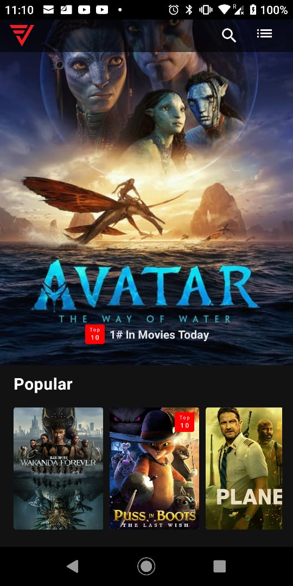
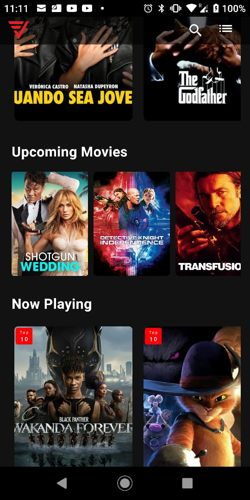
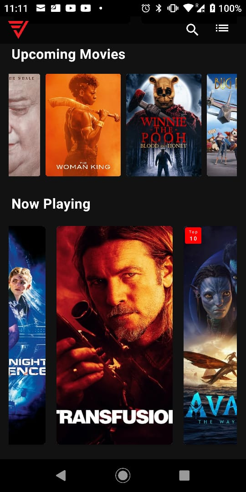
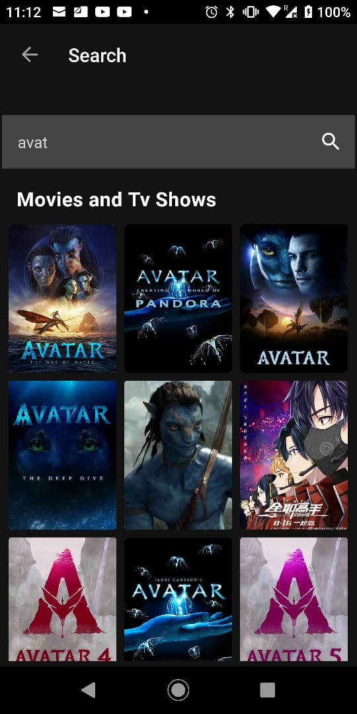

# VxMovieApp
This Movie App is created to demonstrate skills on JetPack Compose.

### Vx Movie app showcases the following:

* MVVM Architecture + Clean Architecture
* Dagger Hilt for DI
* Coil for loading images
* Compose ConstraintLayout
* Compose TopBar 
* Using TMDb API as a data source
* Compose Paging 3 for pagination
* Room Db for local data store
* Kotlin Coroutine + Flow 

### Screens
VxAppDemo Home              |  Home One                     |     Home Items Two                         | Home Items Three |
:-------------------------:|:-------------------------: | :-------------------------: |:-------------------------: 
  |   | 
 |  

Movie Details             |  Movie Details |
:-------------------------:|:-------------------------: | 

Search Empty               |  Search With Data          |
:-------------------------:|:-------------------------: | 
 | 

My List Empty               |  MyList With Data          |
:-------------------------:|:-------------------------: | 
 | 

### Libraries used
* [Jetpack Compose]
* [Compose Navigation]
* [Coroutines]
* [Kotlin Flow]
* [Room Db]
* [Paging Compose]

[Jetpack Compose]: https://developer.android.com/jetpack/compose
[Compose Navigation]: https://developer.android.com/jetpack/compose/navigation
[Coroutines]: https://developer.android.com/kotlin/coroutines
[Kotlin Flow]: https://developer.android.com/kotlin/flow
[Room Db]: https://developer.android.com/jetpack/androidx/releases/room
[Paging Compose]: https://developer.android.com/jetpack/androidx/releases/paging

